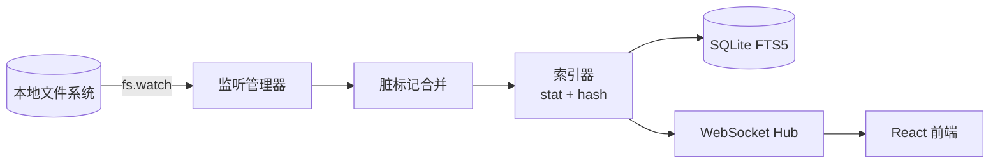
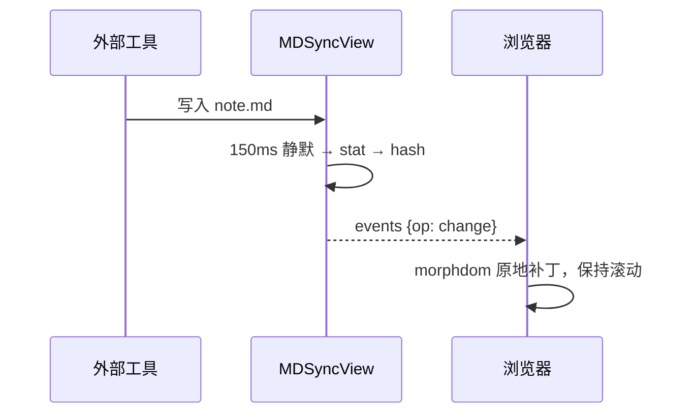

# MDSyncView 渲染能力示例 🚀

这份文档用于验证 **MDSyncView** 的富文本渲染：Emoji、SVG、多媒体、图表、公式、告警块等。修改并保存它，界面会**实时**更新且保持滚动位置。

## 1. Emoji 😀

原生 Unicode：🎉 ✅ ⚠️ 🧠 🇨🇳 👩‍💻 🏳️‍🌈 🆕 — 短代码：:tada: :rocket: :white_check_mark: :warning: :+1:

（这一段在文件被外部修改后实时更新，上方内容长度变化时阅读位置依然保持。）

第二次外部修改：再插入一段文字，用于验证锚点按内容签名而非行号定位。🔁

## 2. 内联 SVG 矢量图

<svg xmlns="http://www.w3.org/2000/svg" viewBox="0 0 320 120" width="320" height="120" role="img" aria-label="demo">
  <defs>
    <linearGradient id="g1" x1="0" y1="0" x2="1" y2="0">
      <stop offset="0" stop-color="#6366f1"/>
      <stop offset="1" stop-color="#0ea5e9"/>
    </linearGradient>
  </defs>
  <rect x="8" y="8" width="304" height="104" rx="16" fill="url(#g1)"/>
  <circle cx="60" cy="60" r="28" fill="#fff" opacity="0.9"/>
  <text x="110" y="68" font-size="26" font-family="Segoe UI, sans-serif" fill="#fff" font-weight="700">Inline SVG ✓</text>
</svg>

SVG 文件引用（通过 `/raw` 端点安全加载）：


## 3. Mermaid 图表





## 4. 数学公式

行内公式 $E = mc^2$，以及块级公式：

$$
\int_{-\infty}^{\infty} e^{-x^2}\,dx = \sqrt{\pi}
$$

## 5. 告警与容器

> [!NOTE]
> GitHub 风格的 Note 告警块。

> [!WARNING]
> 请勿删除 `index.db`，除非你想重建索引。

::: tip 提示
这是 `::: tip` 容器语法。
:::

::: details 点击展开
隐藏的内容 🙈
:::

## 6. 任务列表与表格

- [x] 实时同步
- [x] 富文本渲染
- [ ] 待办：更多主题

| 功能 | 状态 | 备注 |
| --- | :---: | --- |
| 中文文件名 | ✅ | `分析报告.md` |
| 大写扩展名 | ✅ | `NOTES.MD` |
| 原子替换 | ✅ | tmp + rename |

## 7. 代码高亮

```ts
export function toKey(p: string): string {
  return path.resolve(p).replace(/\\/g, '/').toLowerCase();
}
```

```powershell
Get-CimInstance Win32_LogicalDisk -Filter 'DriveType=3' | Select-Object DeviceID
```

## 8. 链接与脚注

- Wiki 链接：[[DESIGN]] 与 [[SHOWCASE|本文]]
- 相对链接：[设计文档](./DESIGN.md)
- 外部链接：[markdown-it](https://github.com/markdown-it/markdown-it)
- 脚注：MDSyncView 使用 FTS5 trigram 索引[^1]。

==高亮文本==，H~2~O，x^2^，<kbd>Ctrl</kbd> + <kbd>P</kbd>。

[^1]: trigram 分词器支持中文子串检索，3 字以下自动降级为子串扫描。
